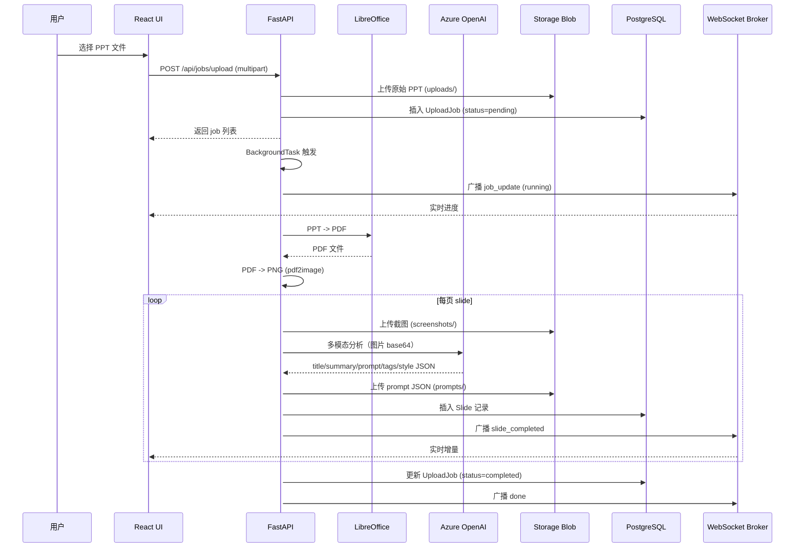

# 架构详解

> 本文档是 [README.md](../README.md) 中"系统架构"章节的扩展，面向开发者解释每一层的职责与扩展点。

## 1. 整体数据流

## 2. 模块职责

### Backend

| 模块 | 职责 |
|---|---|
| `core/config.py` | 通过 pydantic-settings 集中加载配置 |
| `core/security.py` | 校验 Entra ID 颁发的 JWT，缓存 JWKS 公钥 |
| `core/logging.py` | loguru + 标准 logging 桥接 |
| `db/session.py` | 异步 SQLAlchemy 引擎与 session 工厂 |
| `models/models.py` | `UploadJob` / `Slide` ORM |
| `services/storage.py` | Blob 上传/下载/SAS 生成；本地用 connection string，云端用 MI |
| `services/ai.py` | 调 Azure OpenAI，强制 JSON 输出；带 tenacity 指数重试 |
| `services/ppt_renderer.py` | `soffice --convert-to pdf` + `pdf2image` |
| `services/progress.py` | WebSocket 订阅广播 broker |
| `services/orchestrator.py` | 端到端流程：渲染 → AI → 存储 → DB → 广播 |
| `api/jobs.py` | 上传 / 列表 / 触发 / 删除 |
| `api/slides.py` | 列表 / 详情 / 编辑 / 批量删除 / 标签聚合 |
| `api/websocket.py` | `/ws/progress` |
| `main.py` | FastAPI 工厂 + 静态文件托管 + lifespan |

### Frontend

| 模块 | 职责 |
|---|---|
| `theme/theme.ts` | MUI 浅色主题 |
| `api/client.ts` | 统一 axios 客户端 + token 注入 |
| `auth/AuthProvider.tsx` | 拉取 `/api/config` 决定是否启用 MSAL |
| `hooks/useProgressSocket.ts` | WebSocket 订阅 + 自动重连 |
| `pages/DashboardPage.tsx` | 仪表盘（统计、最近任务、实时进度）|
| `pages/UploadPage.tsx` | Dropzone + 多文件上传 |
| `pages/SlideListPage.tsx` | Slide 库（检索/多选/批量删除）|
| `pages/SlideDetailPage.tsx` | Slide 编辑（prompt/tag/title/summary）|

## 3. 鉴权链路

1. SPA 启动 → 调用 `/api/config` → 拿到 `tenant_id` / `api_audience`
2. 若 `auth_enabled=true`，初始化 MSAL；用户点登录走 popup
3. 调用 API 前，axios interceptor 调 `acquireTokenSilent` 拿 access token
4. 后端 `core/security.py` 用 Entra JWKS 验签，并校验 audience / scope

## 4. 异步并发模型

- **进程内并发**：FastAPI 全程 async，单进程即可承担多 job
- **PPT-级并发**：`MAX_CONCURRENT_SLIDE_JOBS`（默认 2）信号量控制
- **页-级并发**：`MAX_CONCURRENT_SLIDE_PAGES`（默认 4）信号量控制
- **重试**：AI 调用失败 → tenacity 指数退避最多 3 次
- **隔离**：每页一个独立 DB session，避免长事务；blob 失败用 `gather(return_exceptions=True)` 不影响主流程

## 5. 失败兜底

- **任务失败**：写 `error_message`，状态 `failed`，前端可点重试 (`POST /jobs/{id}/start`)
- **WS 断开**：前端自动重连（指数退避，5 次），不影响数据
- **Blob 误删**：删除 slide 时只删该 slide 的 2 个 blob，不会影响其他

## 6. 扩展点

- **向量检索**：在 Slide 上加 `embedding` 列（[pgvector](https://github.com/pgvector/pgvector)），新建 slide 时同步生成 embedding
- **任务队列**：高并发场景把 BackgroundTasks 替换为 Celery / arq
- **多租户**：当前 `created_by` 字段已经记录 oid，后续可加 row-level security
- **静态化**：可改用 Azure Static Web Apps 托管前端 + Container Apps 跑后端，分离前后端
